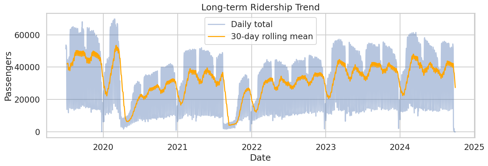

# 🚍 Public Transport Ridership Forecasting

This project analyzes and forecasts public transport ridership across six different service types using advanced time-series forecasting methods such as **SARIMAX**.  
The goal is to understand long-term patterns, seasonality, and provide accurate future forecasts for operational planning.

---

##  **1. Long-Term Ridership Trend**

### 🔹 Insight Summary
- Ridership shows a **steady upward trend** over the years.
- Both median and peak numbers gradually increase, signalling **growing demand**.
- The rising pattern confirms **long-term adoption and network expansion**.
- This trend reflects strong user engagement and post-COVID recovery.

---

##  **2. Annual and Monthly Seasonality**

### 🔹 Insight Summary
- Clear **annual and monthly cycles** appear in the dataset.
- Strong, repeated seasonal peaks and troughs indicate predictable travel behavior.
- Seasonal variations help identify **high-demand months** vs **off-season periods**.
- This cyclic pattern is crucial for planning schedules and resource allocation.

---

##  **3. COVID-19 Impact (2020–2021)**

### 🔹 Insight Summary
- A sharp, unprecedented drop in ridership during the COVID lockdowns.
- This anomaly is **consistent across all services**.
- The steep decline corresponds directly to:
  - Government restrictions  
  - Reduced travel  
  - Remote education/work  
- Essential to exclude or adjust for COVID when training stable predictive models.

---

##  **4. Rapid Route – Most Stable Service**

### 🔹 Insight Summary
- The **Rapid Route** exhibits:
  - The most consistent ridership
  - Low volatility
  - Strong weekly rhythm
- Its stability makes it the **most reliable and predictable service**.
- Indicates it serves as the backbone of the network and responds well to growth.

---

##  **5. Peak Service & School Transport Patterns**

### 🔹 Insight Summary
- **Peak Service**:
  - Strong spikes during weekdays
  - Reflects office/commuter traffic
- **School Service**:
  - High ridership during school terms
  - Drops to near-zero in holidays
- These patterns require:
  - Flexible scheduling  
  - Term-based planning  
  - Seasonal adjustments  

---

#  **SARIMAX Forecasting Model**

## **1. Introduction**
The **SARIMAX** model (Seasonal AutoRegressive Integrated Moving Average with Exogenous Variables) is ideal for time-series data containing:
- Trend  
- Seasonality  
- Autocorrelation  

Public transport ridership fits this structure due to weekly and annual recurring patterns.

---

## **2. SARIMAX Model Structure**

`SARIMAX(p, d, q) × (P, D, Q, s)`

- **p** – Non-seasonal AR order  
- **d** – Trend differencing  
- **q** – Moving average order  
- **P, D, Q** – Seasonal AR, differencing, MA  
- **s** – Seasonal period (7 days for weekly pattern)

---

## **3. Model Optimization**

Steps followed:
- Cleaned and prepared the data  
- Checked stationarity using ADF & KPSS  
- Applied seasonal differencing when needed  
- Used AIC-based search to choose optimal parameters  
- Trained SARIMAX individually for all six services

## **4. Evaluation Metrics**

  SARIMAX performance evaluated using:
- **MAE** – Average error magnitude  
- **RMSE** – Penalizes large errors  
- **MAPE** – Percentage-based accuracy  
- **Residual diagnostics** – Ensured minimal autocorrelation

[Prediction]((PATH/TO/YOUR/school_forecast.png))
